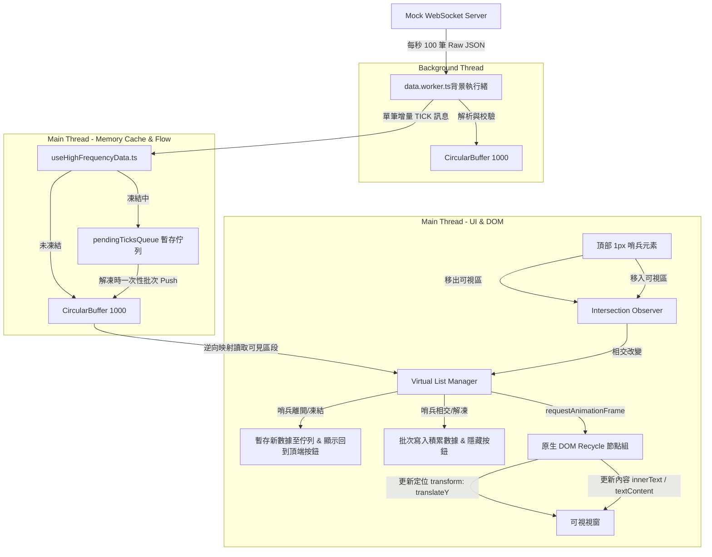

# 高頻成交明細虛擬列表與 DOM 回收實作計畫書 (High-Frequency Virtual List Plan)

本計畫書旨在規劃如何將 `PublicTradesList`（實時成交明細）元件重構，引入「虛擬列表 (Virtual List)」與「DOM 回收再利用 (DOM Recycle)」技術，以突破原先僅能展示 18 筆成交記錄的硬限制，支援在記憶體中維護並滾動檢視高達 1000 筆以上的歷史明細，同時確保系統渲染負荷不隨資料量增加而上升，維持在 58 - 60 FPS 的高度流暢水準。

---

## 1. 核心需求與效能目標 (Requirements & Performance Goals)

- **數據容量突破**：實時成交明細的容量上限由 18 筆擴展至 **1000 筆**（可由常數進行配置調整）。
- **視覺順暢度要求**：在每秒 100 筆以上的高頻 Tick 推送下，不論是處於靜態實時更新狀態，或是使用者進行高速滾動檢視時，畫面均需維持在 **58 - 60 FPS**。
- **記憶體與 CPU 控制**：避免因大量歷史明細的引入而產生垃圾回收（GC）卡頓或 React 虛擬 DOM 頻繁比對帶來的 CPU 過載。
- **無新增/修改程式碼原則**：本階段僅規劃設計方案並更新本檔案，不對現有系統進行任何代碼變更。

---

## 2. 關鍵議題與技術解決方案 (Key Issues & Technical Solutions)

### 議題 A：高頻數據更新與 DOM 節點膨脹的衝突

- **問題描述**：若直接將 1000 筆成交記錄渲染至 HTML 中，當每秒有上百筆新成交推入時，瀏覽器需要頻繁地進行大量 DOM 節點的「插入」與「刪除」操作。這會引發嚴重的排版重構（Reflow）與繪製（Paint）開銷，導致瀏覽器瞬間卡死或大幅掉幀。
- **解決技術**：**原生 DOM 節點回收再利用虛擬列表技術 (Vanilla DOM Recycle & Virtual List)**
- **實作策略**：
  1.  **固定數量的 DOM 節點**：明細列表元件的可視區域（Viewport）內，僅建立固定數量的 `div` 元素（例如可視區可容納 15 個項目，則加上額外的緩衝區，僅建立固定 17 個 DOM 節點）。
  2.  **絕對定位與位移**：所有明細項目的 DOM 節點皆採用 `position: absolute`，並透過 CSS `transform: translateY(...)` 進行定位。
  3.  **節點內容回收覆寫**：在使用者滾動或數據更新時，系統僅計算哪些節點滾出了可視區，將其移動至新的座標，並直接修改其內部的文字內容與樣式，而不進行任何 DOM 節點的銷毀與重新創建。

### 議題 B：React Reconciliation（調和演算法）造成的 CPU 過載

- **問題描述**：若使用 React 來管理 1000 筆大陣列的 State，每秒 100 次的資料變更會迫使 React 進行高頻率的虛擬 DOM Diff 運算，即使只修改 15 個可見的節點，其協調演算法（Reconciliation）的 JS 運算依然會造成嚴重的 CPU 負載。
- **解決技術**：**非 React 綁定的原生渲染管理器 (Bypassing React via Vanilla Ref Manager)**
- **實作策略**：
  1.  **無 State 滾動與內容管理**：將明細列表元件的內部 `list` 狀態從 React `useState` 剝離。
  2.  **Refs 陣列綁定**：使用 `useRef` 保存這組固定的原生 DOM 節點陣列（`div` 節點組）。
  3.  **rAF 驅動渲染**：在 `requestAnimationFrame`（rAF）循環中，直接透過原生 JavaScript 去更新這些 DOM 節點的位移屬性（`style.transform`）與內容（`innerText`），徹底繞過 React 的 Diff 機制，使 JS 計算時間壓縮至每幀低於 1 毫秒。

### 議題 C：高頻即時推送與手動滾動檢視的視覺衝突

- **問題描述**：當使用者向下滾動檢視舊的歷史成交明細時，如果頂部仍以每秒上百筆的速度實時推入最新成交，這會使得主執行緒 `CircularBuffer` 的內部索引和長度不斷位移。若此時仍依據變動中的 Buffer 索引進行虛擬列表的區段讀取，會導致使用者在滾動檢視歷史時，畫面上的成交項目產生嚴重的資料跳動、閃爍與錯誤對位。
- **解決技術**：**非同步交叉觀察與凍結期暫存佇列機制 (Intersection Observer & Pending Ticks Queue)**
- **實作策略**：
  1.  **頂部哨兵元素 (Top Sentinel Element)**：在滾動容器的最頂端放置一個寬高僅 `1px`、透明且不參與實際排版計算的哨兵節點。
  2.  **非同步交叉觀察 (Intersection Observer)**：監聽該哨兵元素是否在可視區域內。這能完全避免使用傳統 `scroll` 事件監聽器頻繁讀取 `scrollTop` 所引發的「強制同步排版（Forced Synchronous Layout）」效能瓶頸。
  3.  **防跳動雙軌凍結流程**：
      - **哨兵離開可視區（凍結狀態）**：當用戶向下滾動使哨兵移出視窗時，觸發非同步回呼將實時更新標記為「凍結狀態」。新收到的 `TICK` 將**暫存於暫存佇列 (`pendingTicksQueue: TickData[]`)** 中，而不推入主渲染緩衝區（HB），使 HB 保持完全靜態，確保滾動檢視歷史的絕對穩定性。
      - **哨兵重新進入可視區 / 點擊解凍（恢復狀態）**：當點擊「回到頂部」或滾動回頂端使哨兵進入視窗時，將 `pendingTicksQueue` 內積累的數據一次性批次 `push` 入 HB，清空暫存佇列，並恢復實時推送。

### 議題 D：大陣列數據傳輸與記憶體垃圾回收 (GC) 壓力

- **問題描述**：若背景 Web Worker 每次都將完整 1000 筆的歷史陣列序列化並傳送給主執行緒，高頻率的結構化複製（Structured Clone）傳輸會消耗極大的執行緒通訊頻寬，並在主執行緒中產生巨大的記憶體垃圾回收負載。
- **解決技術**：**主從執行緒雙端環狀緩衝區同步 (Dual-Circular-Buffer Synchronization)**
- **實作策略**：
  1.  **同步緩衝區**：主執行緒的 `useHighFrequencyData.ts` 同步實作一個最大長度限制為 1000 的 `CircularBuffer`（與 Worker 端規格一致）。
  2.  **增量更新 (Tick-only Transport)**：在正常運作下，Web Worker 僅向主執行緒傳送單一成交增量（`TICK`），主執行緒收到後在本地的緩衝區直接執行 `push`。
  3.  **區段讀取 (Index-based Slice)**：虛擬列表在計算渲染時，僅透過 `get(index)` 讀取主執行緒本地緩衝區對應可視範圍內的資料，避免對整份大陣列進行任何複製、切片（`slice`）或傳輸，實現零記憶體分配的極致效能。

### 議題 E：邏輯索引與 Buffer 物理索引的逆向轉換與未啟用節點隱藏

- **問題描述**：在 `CircularBuffer` 中，`get(0)` 取得的是最舊的成交資料，`get(size - 1)` 是最新成交。但成交明細清單的 UI 呈現要求「最新成交顯示在最上方（即邏輯索引 `0` 代表最新）」。此外，當緩衝區長度不足預設的 DOM 節點數量 $N$，或是首尾邊界滾動時，未啟用的 DOM 節點若無適當處理會產生畫面殘影與重疊。
- **解決技術**：**UI 物理逆向索引映射與節點動態隱藏機制**
- **實作策略**：
  1.  **逆向映射計算**：計算邏輯索引 `i`（`0` 代表最頂部的第一筆）對應的 Buffer 資料索引公式：`dataIndex = (buffer.size() - 1) - i`。
  2.  **取模定位與緩存更新**：使用 pre-allocated 的 $N$ 個原生 DOM 節點，透過取模將邏輯索引 `i` 定位至 `node = domNodes[i % N]`，其位移為 `translateY(i * ITEM_HEIGHT)px`。同時，節點內部的子元素引用（如 `timeSpan`、`priceSpan` 等）應預先進行緩存，更新時直接修改 `textContent`，嚴禁在更新迴圈中調用 `querySelector` 以防 Layout Thrashing。
  3.  **未啟用節點處理**：當 `i >= buffer.size()` 時，表示該 DOM 節點目前無對應數據，必須直接將其設定為 `display: none`（或移出可視區外），徹底消除重疊與殘影。

### 議題 F：Next.js 水合衝突預防與資源主動回收

- **問題描述**：此專案基於 Next.js 架構，依據全域開發規範「禁止使用 `suppressHydrationWarning` 屬性」。由於虛擬列表在客戶端掛載後會直接操作原生 DOM，若直接進行伺服器端渲染將導致嚴重的 Hydration Mismatch。同時，高頻 rAF 迴圈與監聽器若未在組件卸載時妥善清理，會造成嚴重記憶體洩漏。
- **解決技術**：**純客戶端延遲掛載防禦與主動垃圾回收清理機制**
- **實作策略**：
  1.  **雙階段掛載防禦**：使用 `isMounted` 狀態或 `next/dynamic(ssr: false)` 確保虛擬列表僅在客戶端掛載。掛載前在伺服器端渲染與可視區高度一致的靜態預留骨架屏，防止 any 水合衝突。
  2.  **效能微調與動畫移除**：移除明細列表滾動時的 any `transition` 與 `animation`（如原有之 `animate-fade-in`），並為 17 個回收節點套用 `will-change: transform` 與 `contain: layout size`，確保滾動達到硬體級加速。
  3.  **Passive 滾動監聽**：ViewPort 的 `scroll` 事件監聽必須宣告 `{ passive: true }`，並透過 rAF 節流控制，防止滾動阻塞與卡頓。
  4.  **防洩漏資源清理**：在 React `useEffect` 的清理函式中，必須明確執行：`cancelAnimationFrame` 停止渲染循環、`observer.disconnect()` 關閉相交觀測器、移除 `scroll` 監聽器，並清空 DOM reference 與暫存佇列。

---

## 3. 系統架構與資料流向 (Architecture & Data Flow)

在引進本計畫的優化後，整體系統的數據管道與渲染管道關係如下：



---

## 4. 系統常數新增配置 (Proposed Constant Extensions)

為配合本規劃方案，`constants/chart.ts` 將預計擴充以下常數控制參數：

```typescript
export const VIRTUAL_LIST_CONSTANTS = {
  /** 實時成交明細歷史快取最大筆數 */
  TRADES_BUFFER_CAPACITY: 1000,

  /** 明細列表單一項目高度（像素，用於虛擬列表高度計算） */
  TRADE_ITEM_HEIGHT: 32,

  /** 明細可視區域預設高度（像素） */
  VIEWPORT_HEIGHT: 240,

  /** 虛擬列表上下緩衝區節點數量（防止高速滾動露白） */
  BUFFER_ITEMS_COUNT: 2,
} as const;
```

---

## 5. 開發實作階段規劃 (Implementation Roadmap)

為確保開發品質與系統穩定度，本需求在未來獲准執行時，將細分為以下三個步驟實作：

### 階段一：底層資料結構與 Hook 通訊增量重構 [已完成]

- [x] 擴充 `constants/chart.ts`，加入虛擬列表與成交緩衝區常數。
- [x] 重構 `useHighFrequencyData.ts` 中的 `TICK` 訊息處理流程，確保主執行緒之歷史緩衝長度可同步擴展至 1000 筆，並封裝高效的局部讀取 API。
- [x] 實作主執行緒的 `pendingTicksQueue` 暫存邏輯，以支援滾動凍結時的資料雙軌處理。
- [x] 驗證並確認在 1000 筆的大容量下，雙端執行緒通訊並無因資料傳輸而造成 CPU 佔用率上升。

### 階段二：原生 DOM 虛擬列表與 Recycle 渲染器開發

- [x] 在 `components` 目錄下建立全新的 `VirtualTradesList.tsx` 元件。
- [x] 實作 `isMounted` 或 `next/dynamic(ssr: false)` 防禦性掛載檢查，確保不使用 `suppressHydrationWarning` 且無水合衝突。
- [x] 實作視窗計算器，依據設定的項目高度與可視高度，計算出需要建立的原生 DOM 節點數量。
- [x] 利用 `useRef` 及 `useEffect` 初始化這批 DOM 節點，並緩存其內部的子元素 DOM 引用。
- [x] 套用 `will-change: transform` 與 `contain: layout size`，並確保移除原有明細列表滾動時的 entry 慢速動畫。
- [x] 實作物理/邏輯逆向索引映射 `(buffer.size() - 1) - i` 與 `i >= buffer.size()` 節點隱藏機制。
- [x] 在滾動容器的最頂端嵌入 `1px` 透明的 `div` 作為哨兵元素，並初始化 `IntersectionObserver` 監聽其相交狀態。
- [x] 註冊 Viewport 滾動監聽時加入 `{ passive: true }`，並使用 rAF 進行渲染位置與內容更新。

### 階段三：滾動凍結機制與效能整合驗證 [已完成]

- [x] 實作哨兵元素狀態偵測邏輯，當非相交（不置頂）時，阻斷來自 Hook 的 `TICK` 寫入 HB，改為存入 `pendingTicksQueue`。
- [x] 建立懸浮「最新成交」按鈕，並在哨兵非相交時顯示，綁定點擊後解凍與滾動回頂端之互動。
- [x] 在組件的 `useEffect` 清除函式中，確實回收 rAF、相交觀測器、滾動事件監聽與記憶體佇列。
- [x] 進行效能品質驗證：
  - [x] 使用 Chrome DevTools 錄製效能軌跡，確保靜態更新與手動滾動歷史時，主執行緒皆維持在 **60 FPS**（無掉幀現象）。
  - [x] 監控靜態滾動凍結狀態下，資料是否能保持絕對靜態不跳動，且解凍後能一次性流暢補齊。
  - [x] 監控 JS Heap 記憶體曲線，確認無階梯狀的記憶體洩漏與密集的 GC 行為。
